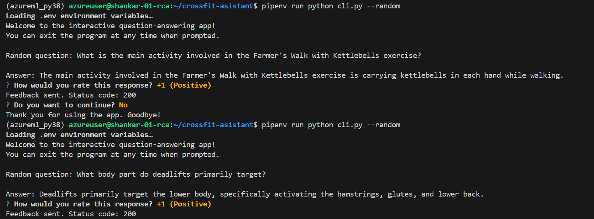
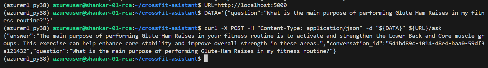
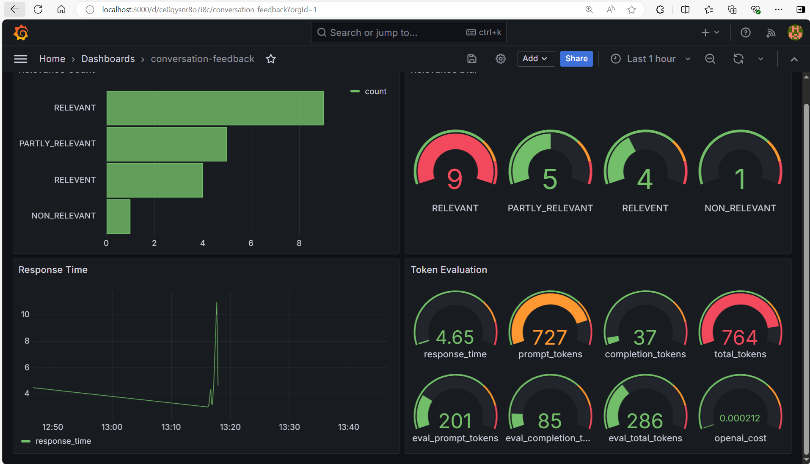
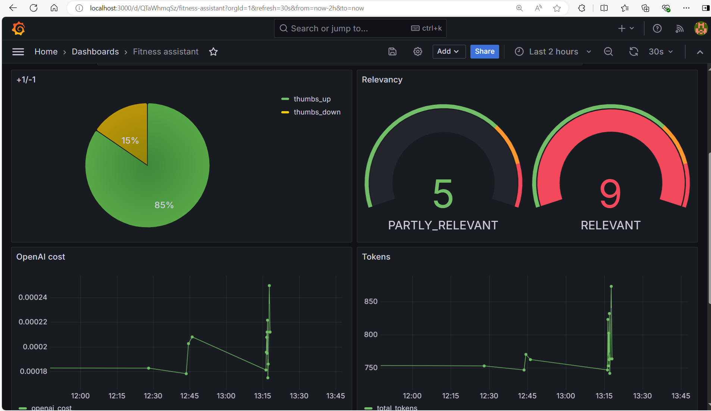

# Cross~Fit Assistant

<p align="center">
  
  
</p>


The Fitness Assistant provides a conversational AI that helps
users choose exercises and find alternatives, making fitness more
manageable.

## Project overview

The Fitness Assistant is a RAG application designed to assist
users with their fitness routines.

The main use cases include:

1. Exercise Selection: Recommending exercises based on the type
of activity, targeted muscle groups, or available equipment.
2. Exercise Replacement: Replacing an exercise with suitable
alternatives.
3. Exercise Instructions: Providing guidance on how to perform a
specific exercise.
4. Conversational Interaction: Making it easy to get information
without sifting through manuals or websites.

## Dataset

The dataset used in this project contains information about
various exercises, including:

- **Exercise Name:** The name of the exercise (e.g., Push-Ups, Squats).
- **Session Name:** Name of Fitness Session or Class
- **Type of Activity:** The general category of the exercise (e.g., Strength, Mobility, Cardio).
- **Type of Equipment:** The equipment needed for the exercise (e.g., Bodyweight, Dumbbells, Kettlebell).
- **Body Part:** The part of the body primarily targeted by the exercise (e.g., Upper Body, Core, Lower Body).
- **Type:** The movement type (e.g., Push, Pull, Hold, Stretch).
- **Muscle Groups Activated:** The specific muscles engaged during
the exercise (e.g., Pectorals, Triceps, Quadriceps).
- **Instructions:** Step-by-step guidance on how to perform the
exercise correctly.

The dataset was generated using ChatGPT and contains 207 records. It serves as the foundation for the Fitness Assistant's exercise recommendations and instructional support.

You can find the data in [data](data/crossfit_exercise_plan_01.csv)

## Technologies

- Python 3.11
- Docker and Docker Compose for containerization
- [Minsearch](https://github.com/alexeygrigorev/minsearch) for full-text search
- Flask as the API interface (see [Background](#background) for more information on Flask)
- Grafana for monitoring and PostgreSQL as the backend for it
- OpenAI as an LLM

## Preparation

Since we use OpenAI, you need to provide the API key:

1. Install `direnv`. If you use Ubuntu, run `sudo apt install direnv` and then `direnv hook bash >> ~/.bashrc`.
2. Insert your Open AI key in ".env" file.
3. For OpenAI, it's recommended to create a new project and use a separate key.
4. Run `direnv allow` to load the key into your environment.

For dependency management, we use pipenv, so you need to install it:

```bash
pip install pipenv
```

Once installed, you can install the app dependencies:

```bash
pipenv install --dev
```

## Running the application


### Database configuration

Before the application starts for the first time, the database
needs to be initialized.

First, run `postgres`:

```bash
docker-compose up postgres
```

Then run the [`db_prep.py`](fitness_assistant/db_prep.py) script:

```bash
pipenv shell

cd fitness_assistant

export POSTGRES_HOST=localhost
python db_prep.py
```

To check the content of the database, use `pgcli` (already
installed with pipenv):

```bash
pipenv run pgcli -h localhost -U your_username -d course_assistant -W
```

You can view the schema using the `\d` command:

```sql
\d conversations;
```

And select from this table:

```sql
select * from conversations;
```

### Running with Docker-Compose

The easiest way to run the application is with `docker-compose`:

```bash
docker-compose up
```

### Running locally

If you want to run the application locally,
start only postres and grafana:

```bash
docker-compose up postgres grafana
```

If you previously started all applications with
`docker-compose up`, you need to stop the `app`:

```bash
docker-compose stop app
```

Now run the app on your host machine:

```bash
pipenv shell

cd fitness_assistant

export POSTGRES_HOST=localhost
python app.py
```

### Running with Docker (without compose)

Sometimes you might want to run the application in
Docker without Docker Compose, e.g., for debugging purposes.

First, prepare the environment by running Docker Compose
as in the previous section.

Next, build the image:

```bash
docker build -t fitness-assistant .
```

And run it:

```bash
docker run -it --rm \
    --network="fitness-assistant_default" \
    --env-file=".env" \
    -e OPENAI_API_KEY=${OPENAI_API_KEY} \
    -e DATA_PATH="data/data.csv" \
    -p 5000:5000 \
    fitness-assistant
```

## Using the application

When the application is running, we can start using it.

### CLI

We built an interactive CLI application using
[questionary](https://questionary.readthedocs.io/en/stable/).

To start it, run:

```bash
pipenv run python cli.py
```

You can also make it randomly select a question from
[our ground truth dataset](data/ground-truth-retrieval.csv):

```bash
pipenv run python cli.py --random
```

<p align="center">
  
</p>

### Using `requests`

When the application is running, you can use
[requests](https://requests.readthedocs.io/en/latest/)
to send questions—use [test.py](test.py) for testing it:

```bash
pipenv run python test.py
```

It will pick a random question from the ground truth dataset
and send it to the app.

### CURL

You can also use `curl` for interacting with the API:

```bash
URL=http://localhost:5000
DATA='{"question":"What is the main purpose of performing Glute-Ham Raises in my fitness routine?"}'
curl -X POST -H "Content-Type: application/json" -d "${DATA}" ${URL}/ask
```

You will see something like the following in the response:

```json
{"answer":"The main purpose of performing Glute-Ham Raises in your fitness routine is to activate and strengthen the Lower Back and Core muscle groups. This exercise can help enhance core stability and improve overall strength in these areas.",
"conversation_id":"541bd89c-1014-48e4-baa0-59df3a121432",
"question":"What is the main purpose of performing Glute-Ham Raises in my fitness routine?"}
```
<p align="center">
  
</p>

Sending feedback:

```bash
ID="541bd89c-1014-48e4-baa0-59df3a121432"
URL=http://localhost:5000
FEEDBACK_DATA='{
    "conversation_id": "'${ID}'",
    "feedback": 1
}'

curl -X POST \
    -H "Content-Type: application/json" \
    -d "${FEEDBACK_DATA}" \
    ${URL}/feedback
```

After sending it, you'll receive the acknowledgement:

```json
{
    "message": "Feedback received for conversation 541bd89c-1014-48e4-baa0-59df3a121432: 1"
}
```

## Code

The code for the application is in the [`fitness_assistant`](fitness_assistant/) folder:

- [`app.py`](fitness_assistant/app.py) - the Flask API, the main entrypoint to the application
- [`rag.py`](fitness_assistant/rag.py) - the main RAG logic for building the retrieving the data and building the prompt
- [`ingest.py`](fitness_assistant/ingest.py) - loading the data into the knowledge base
- [`minsearch.py`](fitness_assistant/minsearch.py) - an in-memory search engine
- [`db.py`](fitness_assistant/db.py) - the logic for logging the requests and responses to postgres
- [`db_prep.py`](fitness_assistant/db_prep.py) - the script for initializing the database

We also have some code in the project root directory:

- [`test.py`](test.py) - select a random question for testing
- [`cli.py`](cli.py) - interactive CLI for the APP

### Interface

We use Flask for serving the application as an API.

Refer to the ["Using the Application" section](#using-the-application)
for examples on how to interact with the application.

### Ingestion

The ingestion script is in [`ingest.py`](fitness_assistant/ingest.py).

Since we use an in-memory database, `minsearch`, as our
knowledge base, we run the ingestion script at the startup
of the application.

It's executed inside [`rag.py`](fitness_assistant/rag.py)
when we import it.

## Experiments

For experiments, we use Jupyter notebooks.
They are in the [`notebooks`](notebooks/) folder.

To start Jupyter, run:

```bash
cd notebooks
pipenv run jupyter notebook
```

We have the following notebooks:

- [`rag-test.ipynb`](notebooks/rag-test.ipynb): The RAG flow and evaluating the system.
- [`evaluation-data-generation.ipynb`](notebooks/evaluation-data-generation.ipynb): Generating the ground truth dataset for retrieval evaluation.

### Retrieval evaluation

The basic approach - using `minsearch` without any boosting - gave the following metrics:

- Hit rate: 63%
- MRR: 38%
```json
{'hit_rate': 0.6286111111111111, 'mrr': 0.38161243386243415}
```
The improved version (with tuned boosting):

- Hit rate: 77%
- MRR: 51%
```json
{'hit_rate': 0.7702777777777777, 'mrr': 0.5145450837742503}
```
The best boosting parameters:

```python
boost = {'exercise_name': 2.59,
          'type_of_activity': 1.51,
          'type_of_equipment': 0.90,
          'body_part': 2.35,
          'type': 1.81,
          'muscle_groups_activated': 2.46,
          'instructions': 0.04
            }
```

### RAG flow evaluation

We used the LLM-as-a-Judge metric to evaluate the quality
of our RAG flow.

For `gpt-4o-mini`, in a sample with 200 records, we had:

- (59.5%) `RELEVANT`
- (32.5%) `PARTLY_RELEVANT`
- (0.8%) `NON_RELEVANT`


## Monitoring

We use Grafana for monitoring the application. 

It's accessible at [localhost:3000](http://localhost:3000):

- Login: "admin"
- Password: "admin"

### Dashboards

<p align="center">
  
</p>

<p align="center">
  
</p>

The monitoring dashboard contains several panels:

1. **Last 5 Conversations (Table):** Displays a table showing the five most recent conversations, including details such as the question, answer, relevance, and timestamp. This panel helps monitor recent interactions with users.
2. **+1/-1 (Pie Chart):** A pie chart that visualizes the feedback from users, showing the count of positive (thumbs up) and negative (thumbs down) feedback received. This panel helps track user satisfaction.
3. **Relevancy (Gauge):** A gauge chart representing the relevance of the responses provided during conversations. The chart categorizes relevance and indicates thresholds using different colors to highlight varying levels of response quality.
4. **OpenAI Cost (Time Series):** A time series line chart depicting the cost associated with OpenAI usage over time. This panel helps monitor and analyze the expenditure linked to the AI model's usage.
5. **Tokens (Time Series):** Another time series chart that tracks the number of tokens used in conversations over time. This helps to understand the usage patterns and the volume of data processed.
6. **Model Used (Bar Chart):** A bar chart displaying the count of conversations based on the different models used. This panel provides insights into which AI models are most frequently used.
7. **Response Time (Time Series):** A time series chart showing the response time of conversations over time. This panel is useful for identifying performance issues and ensuring the system's responsiveness.

### Setting up Grafana

All Grafana configurations are in the [`grafana`](grafana/) folder:

- [`init.py`](grafana/init.py) - for initializing the datasource and the dashboard.
- [`dashboard.json`](grafana/dashboard.json) - the actual dashboard (taken from LLM Zoomcamp without changes).

To initialize the dashboard, first ensure Grafana is
running (it starts automatically when you do `docker-compose up`).

Then run:

```bash
pipenv shell

cd grafana

# make sure the POSTGRES_HOST variable is not overwritten 
env | grep POSTGRES_HOST

python init.py
```

Then go to [localhost:3000](http://localhost:3000):

- Login: "admin"
- Password: "admin"

When prompted, keep "admin" as the new password.

## Background

Here we provide background on some tech not used in the
course and links for further reading.

### Flask

We use Flask for creating the API interface for our application.
It's a web application framework for Python: we can easily
create an endpoint for asking questions and use web clients
(like `curl` or `requests`) for communicating with it.

In our case, we can send questions to `http://localhost:5000/ask`.
